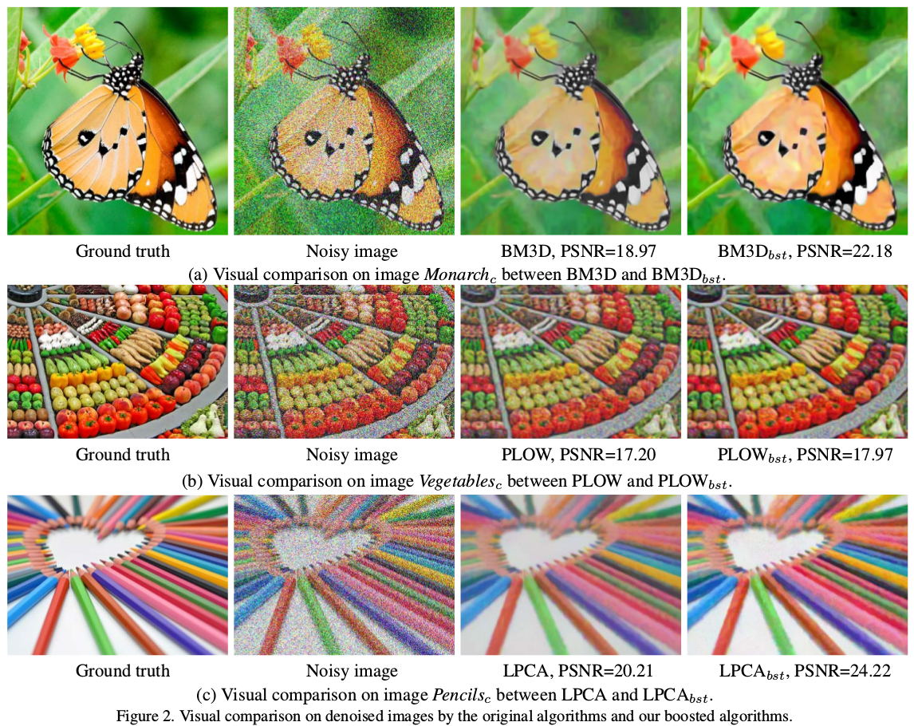
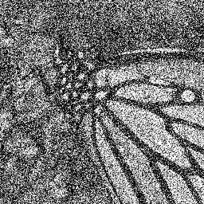
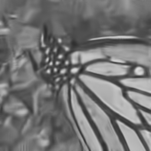
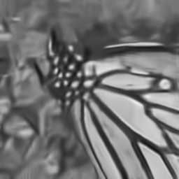

# boostBM3D_betterPatchMatching
This is an implementation of a boosted BM3D in our WACV 2019 paper: "Good Similar Patches for Image Denoising."

||
|:--:|
|  Overview |
## Reference
Si Lu, Good Similar Patches for Image Denoising, IEEE Winter Conference on Applications of Computer Vision (WACV),  Waikoloa Village, HI, USA. 2019  
The paper could be found at http://web.cecs.pdx.edu/~lusi/WACV_311_offical.pdf, please cite our paper if you use this implementation.

## Abstract
Patch-based denoising algorithms like BM3D have achieved outstanding performance. An important idea for the success of these methods is to exploit the recurrence of similar patches in an input image to estimate the underlying image structures. However, in these algorithms, the similar patches used for denoising are obtained via Nearest Neighbour Search (NNS) and are sometimes not optimal. First, due to the existence of noise, NNS can select similar patches with similar noise patterns to the reference patch. Second, the unreliable noisy pixels in digital images can bring a bias to the patch searching process and result in a loss of color fidelity in the final denoising result. We observe that given a set of good similar patches, their distribution is not necessarily centered at the noisy reference patch and can be approximated by a Gaussian component. Based on this observation, we present a patch searching method that clusters similar patch candidates into patch groups using Gaussian Mixture Model-based clustering, and selects the patch group that contains the reference patch as the final patches for denoising. We also use an unreliable pixel estimation algorithm to pre-process the input noisy images to further improve the patch searching. Our experiments show that our approach can better capture the underlying patch structures and can consistently enable the state-of-the-art patch-based denoising algorithms, such as BM3D, LPCA and PLOW, to better denoise images by providing them with patches found by our approach while without modifying these algorithms.

## License
For academic use only. All rights reserved to the authors of the paper. If you have any questions, comments or suggestions please contact Si Lu at lusi@pdx.edu or daniel08220822@gmail.com. Please cite our paper if you use this piece of code.

## Setup
1. How to Compile `BM3D_core.mexwin64` in folder `./mexSrc`:  
(1) Install fftw libary (http://fftw.org/) into folder `./fftw-3.3.4-dll64`  
(2) Copy libfftw3f-3.dll to the root folder  
(3) Go to folder `mexSrc/` in MATLAB and compile use: 
```
mex -llibfftw3f-3 -L./fftw-3.3.4-dll64 -I./fftw-3.3.4-dll64 -I./localLib BM3D_core.cpp bm3d.cpp lib_transforms.cpp utilities.cpp mt19937ar.c
```
2. Tested on Windows 7, using MATLAB 2012b and MATLAB 2015b with compatible C/C++ mex compilers.

## Demo
Open MATLAB, go to the root folder, run
```
demo
```

## Result
|||
|:--:|:--:|
| Clean image | Input noisy image |


|||
|:--:|:--:|
| BM3D, PSNR = 20.674| our BM3D_bst, PSNR = 21.476|
